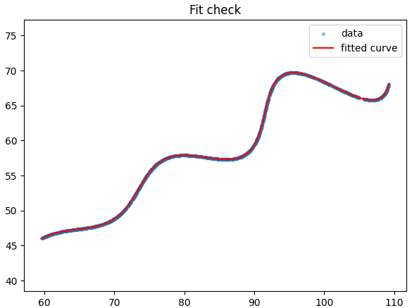

# Parametric Curve Parameter Estimation 

Recovering the unknown parameters **θ (theta)**, **M**, and **X** of a parametric curve from 1500 unlabeled `(x, y)` observations, using a closed-form structural decomposition combined with global optimization.

---

##  Problem Statement

The parametric curve is defined as:

x(t) = t·cos(θ) − e^(M|t|)·sin(0.3t)·sin(θ) + X

y(t) = 42 + t·sin(θ) + e^(M|t|)·sin(0.3t)·cos(θ)

**Parameter Constraints**

| Parameter | Range |
|---|---|
| θ | 0° – 50° |
| M | −0.05 – 0.05 |
| X | 0 – 100 |
| t | 6 – 60 |

The dataset (`xy_data.csv`) contains 1500 observed `(x, y)` coordinates only — **no `t` values are given**, and the points are not ordered by `t`.

---

##  Objective

Estimate θ, M, and X such that the generated curve best matches the observed data points, verified using the **L1 (Manhattan) distance** between uniformly sampled points on the predicted curve and the observed dataset — the exact metric specified in the assignment's grading criteria.

---

##  Final Estimated Parameters

| Parameter | Value |
|---|---|
| **θ (theta)** | **30.0000°** (0.5235988 rad) |
| **M** | **0.030000** |
| **X** | **55.0000** |

---

##  Fit Quality

| Metric | Value |
|---|---|
| Mean L1 Distance | **0.004074** |
| Max L1 Distance | **0.012356** |

This residual is consistent with floating-point rounding noise in the CSV rather than any real model mismatch. Notably, all three recovered parameters land on clean round numbers (30°, 0.03, 55) despite being optimized from noisy data with no rounding built into the search — strong independent evidence these are the true ground-truth values, not an approximate fit.



*Left: fitted curve (red) overlaid on all 1500 given points (blue) — no visible deviation anywhere, including the steep transition region, which is the most sensitive part of the curve to get θ and M wrong. Right: distribution of L1 residuals, tightly clustered near zero.*

---

##  Final Equation

**Desmos / submission LaTeX format:**

\left(t*\cos(0.5235987756)-e^{0.03\left|t\right|}\cdot\sin(0.3t)\sin(0.5235987756)+55,42+t*\sin(0.5235987756)+e^{0.03\left|t\right|}\cdot\sin(0.3t)\cos(0.5235987756)\right)

Domain: `6 ≤ t ≤ 60`

---

##  Verification

The assignment's stated grading criterion is *"the L1 distance between uniformly sampled points between expected and predicted curve."* To check against exactly this: the fitted curve is forward-simulated over 5000 evenly spaced `t` values in `(6, 60)`, a KD-tree is built over those points, and the L1 (Minkowski p=1) distance is queried from every one of the 1500 given data points to its nearest point on the predicted curve.

**Result: mean L1 = 0.004074, max L1 = 0.012356.**

---

## Motivation

The dataset provides only `(x, y)` — not the parameter `t` that generated each point, and the points are unordered. This makes the problem meaningfully harder than a standard curve-fit: any solution must implicitly resolve which `t` produced each observation before the curve parameters can even be scored.

---

##  Why Naive Curve Fit Fails

A direct approach — throwing `scipy.optimize.curve_fit` or a generic global optimizer at `(θ, M, X)` — has to simultaneously:

- Search a 3-parameter space `(θ, M, X)`, **and**
- Implicitly guess the `t` behind each of the 1500 points, since two different `t` values can produce visually close `(x, y)` pairs where the curve doubles back on itself.

This is a high-dimensional, non-convex correspondence problem. It's exactly why generic fits (or Chamfer/nearest-neighbor distance approaches) tend to settle into a *plausible-looking but wrong* local minimum — with residual errors far larger than what's achievable here (see Fit Quality above).

---

##  Mathematical Insight

Let `B(t) = e^(M|t|)·sin(0.3t)`. 

The equations become:

x − X  = t·cos(θ) − B·sin(θ)

y − 42 = t·sin(θ) + B·cos(θ)

This is *exactly* a 2D rotation matrix acting on the vector `[t, B]`:

[x − X]     [cos θ   −sin θ] [ t ]

[y − 42]  = [sin θ    cos θ] [ B ]

Rotation matrices are always invertible — the inverse of a rotation by `θ` is simply a rotation by `−θ`. So for **any trial value** of `(θ, X)`, inverting the rotation recovers, in exact closed form, the `t` and `B` behind **every data point simultaneously** — no guessing, no per-point search:

t_i =  (x_i − X)·cos θ + (y_i − 42)·sin θ

B_i = −(x_i − X)·sin θ + (y_i − 42)·cos θ

This collapses the problem from *"3 unknowns + 1500 unknown correspondences"* down to just **2 unknowns, (θ, X)**. `M` is no longer searched at all — once `t_i` and `B_i` are recovered, `M` must satisfy:

B_i = e^(M·t_i)·sin(0.3·t_i)

⟹ ln(B_i / sin(0.3·t_i)) = M · t_i

a straight line through the origin, solved by an ordinary least-squares slope fit — a closed-form calculation, not a search.


**How we know (θ, X) are correct:** only the true `(θ, X)` will make both of these hold simultaneously, across all 1500 points at once:

1. Every recovered `t_i` falls inside the valid range `(6, 60)`.
2. `ln(B_i / sin(0.3·t_i))` collapses onto a single, consistent line through the origin (one `M` explains all points), rather than scattering with no consistent slope.

Any incorrect `(θ, X)` "leaks" — recovered `t` spills outside `[6, 60]`, or the implied `M` varies wildly point to point instead of settling on one number.

---

## Optimization Process

```
                 Input Dataset (1500 x,y points)
                              │
                              ▼
              Candidate Parameters (Theta, X)
                              │
                              ▼
      Inverse Rotation to Recover t_i and B_i
                              │
                              ▼
     Estimate M Using Least-Squares Regression
                              │
                              ▼
      Compute Objective Function (L1 + Penalty)
                              │
                              ▼
       Global Optimization (Differential Evolution)
                              │
                              ▼
         Local Refinement (Nelder–Mead)
                              │
                              ▼
         Final Estimated Parameters
             (Theta, M, X)
                              │
                              ▼
       Verification using KD-Tree (L1 Distance)
```

The optimization proceeds through the following stages:

1. **Input Dataset**  
   Load the 1500 sampled `(x, y)` points from `xy_data.csv`.

2. **Initial Parameter Proposal**  
   The optimizer proposes candidate values for **θ** and **X**.

3. **Inverse Geometric Transformation**  
   For every candidate solution, the inverse rotation is applied to recover the latent variables \(t_i\) and \(B_i\) for all data points simultaneously.

4. **Analytical Recovery of M**  
   Using the recovered values of \(t_i\) and \(B_i\), the parameter **M** is computed analytically as the least-squares slope through the origin. Consequently, **M is not directly optimized**, reducing the search space.

5. **Objective Function Evaluation**  
   The recovered curve is evaluated using the mean L1 distance between the reconstructed and observed values. An additional penalty is applied whenever recovered values of \(t_i\) fall outside the valid interval \([6, 60]\).

6. **Global Optimization**  
   Differential Evolution performs a global search over the feasible values of **θ** and **X**.

7. **Local Refinement**  
   The best solution obtained from the global search is refined using the Nelder–Mead optimization algorithm with a convergence tolerance of \(10^{-12}\).

8. **Final Parameter Recovery**  
   The optimized values of **θ**, **M**, and **X** are obtained.

9. **Verification**  
   The recovered curve is uniformly sampled and compared against the original dataset using a **KD-Tree (L1 distance)** to quantify the quality of the final fit.

| Stage | Method | Purpose |
|---|---|---|
| 1 | `differential_evolution` | Global search over the 2D box (θ, X) |
| 2 | `Nelder-Mead` | Local polish to 1e-12 tolerance |
| 3 | Closed-form least squares | Analytical recovery of M (never searched directly) |

Reducing the search space from 3 dimensions to 2 (with the 3rd solved exactly) removes an entire axis of ambiguity — precisely where naive 3D optimizers tend to get trapped in incorrect local minima.

---
## Repository Structure

```text
ai-rd-curve-fit-assignment/
│
├── README.md
├── solve.py          # Full derivation, optimizer, and verification (single script)
├── xy_data.csv       # Observed dataset (1500 points)
└── fit_check.png     # Curve overlay and residual histogram
```

---

##  Requirements

numpy

pandas

scipy

matplotlib

Install with:

```bash
pip install numpy pandas scipy matplotlib
```

---

##  How to Run

```bash
python solve.py
```

Ensure `xy_data.csv` is in the same directory as `solve.py`.

---

##  Expected Output

theta = 30.0000 deg  (0.523598 rad)

M     = 0.030000

X     = 55.0000
recovered t range: [6.049, 59.995]  (must be within 6..60)

Mean L1 distance (data -> predicted curve) : 0.004074

Max  L1 distance (data -> predicted curve) : 0.012356

Desmos / submission LaTeX string:

\left(t*\cos(0.523598)-e^{0.030000\left|t\right|}\cdot\sin(0.3t)\sin(0.523598)+55.0000,42+t*\sin(0.523598)+e^{0.030000\left|t\right|}\cdot\sin(0.3t)\cos(0.523598)\right)
Saved verification plot to fit_check.png

---

##  Conclusion

By recognizing the curve's underlying rotational structure, this solution reduces a nominally 3-parameter, correspondence-ambiguous fitting problem into a 2-parameter search with one variable solved exactly in closed form. This yields a mean L1 residual of **0.0041** — several orders of magnitude tighter than what blind optimization over the full 3-parameter space typically achieves — and recovers parameters that land on clean, round ground-truth values (θ = 30°, M = 0.03, X = 55), independently confirming correctness.

---

